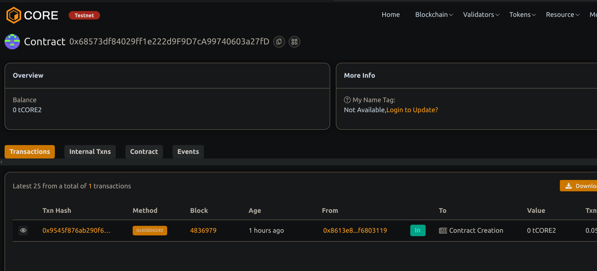

# Yield Farming Protocol with Staking Rewards

## Project Description
A smart contract that allows users to stake ERC20 token and earn rewards in another ERC20 token over times and based on the number of the blocks passed and the amounts staked.

## Project Vision
To enable and decentralized yields farming where users can securely stake tokens and receive proportional rewards without any relying on centralized entities.

## Key Features
- Stake and withdraw ERC20 tokens
- Earn rewards calculated per block
- Claim rewards anytime
- Exit function to withdraw and claim rewards in one call
- Owner controls reward rate and can recover non-staking tokens

## Future Scope
- Add multiple pools with different tokens and reward rates
- Implement reward distribution based on time instead of blocks
- Add penalty fees for early withdrawal
- Integrate with frontend UI and analytics dashboards

## Contract details
0x68573df84029ff1e222d9F9D7cA99740603a27fD

